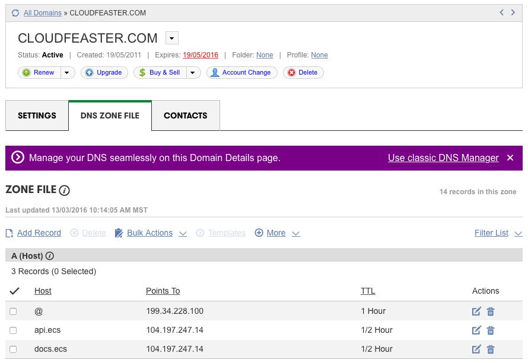

# Provisioning

These instructions describe how to ...

## Setup Google Compute Engine Project

* setup a project in the
[Google Developer Console](https://console.developers.google.com/project) - in
the instructions below the project will be called ```ecs```

* enable the ```compute engine API``` in
the [Google Developer Console](https://console.developers.google.com/project)

* ```gcloud auth login```

* ```gcloud config set project ecs```

* ```gcloud config set compute/zone us-central1-a```

## Choose Domain Names

* choose 2 x domain names - (i) api & (ii) docs - ECS has been tested
assuming domain names will be of the form ```api.ecs.yourservice.yourdomain.com```
and ```docs.ecs.yourservice.yourdmain.com```
* for example, [Cloudfeaster](https://github.com/simonsdave/cloudfeaster)
uses ECS and deploys it to
the ```api.ecs.cloudfeaster.com``` and ```docs.ecs.cloudfeaster.com```
domains

## Create SSL/TLS Certificates

* create SSL/TLS certs for the 2 x previously choosen domain names

## Create Strong(er) DHE Parameter

* see [this](https://raymii.org/s/tutorials/Strong_SSL_Security_On_nginx.html#Forward_Secrecy_&_Diffie_Hellman_Ephemeral_Parameters)
for reference
* previously generated DHE parameters may be used when 
spinning up the deployment ie you don't always need to
generate the parameters
* the command below took about 3 minutes to run on Mac OS X
with a 2.5 GHz Intel Core i5

```bash
>cd /vagrant
>openssl dhparam -out dhparam.pem 4096
>cat dhparam.pem
-----BEGIN DH PARAMETERS-----
MIICCAKCAgEAkwqgBasqm+j+kD4DzB6xgTOUbpJHKpERP/roeQQG+PHV5sGSDc5T
9Ngy/pp2py9xFz4ZmbS9zSW9pLdUYvmUTSJyaGWgotzEuwKX8gQLR+GbcEC1MVwy
X9BSpKyxbUjSUWijVLEg0WMS8pui6rTnk0R/Z0GIbpNYdVdXHEm6pUwDuw6j6QhD
qqIyH72/DmR9PiNLWZJT8Vq6LecUw8EGXqQNpkl5zCukW594wwjsJqUtWtb8/sDs
sRqNX1Sw8BRrXkJHuQKKUCUhUTZH+bsOBxl71ntZdnWPtS/w7hSlKnTPk3M/N3P4
mM9vvSjk2F37vnaWMrs5rkkI7rhNB5FNMkPvGBk637IBV5UvZ0y1pRxZ4CjJj/m4
mbmf/3lkor4jXgpeXVbHPgwEGb3sHAlvFaiaW+XhDbUiblGxkyM0boy7SQX6GDlL
u5TWtnrXp553qtGFnxfvD4tDv5J8SFPmGDy+uVEA6qYemYnKJyUaL17ra/G8TCA6
wGSZYla/xC1nxN/gFJd9g+6IdUpx987OqM1WxzobEyi6MZ0HDjBSfgoHfXgiG2IB
enOCulU7Pzj3vU4Do/CDFrUr6ld4frCOrnCX1lSYkl1zZfC3s2SzX9oRbvdgzv5m
ZiqH+qwj8aOZLDmsngLLe8/8GO7YUYX/rapcw1PQpwrHixjltX83utMCAQI=
-----END DH PARAMETERS-----
```

## Create API Credentials

* if you've already got a previously generated set of credentials then
you can use them
* if you need to generate credentials

```bash
> ecsctl.sh creds 5
Putting hashed credentials in new file '/home/vagrant/ecs/.htpasswd'
ed662dd52ae74ffd8a39a9c83938cfc8:e81e499c9062e25fb49083038f080721
1133cea55a2348f5a3fcddbad0fc6d80:8a7c79fcbda71a6bcbcdb07d12ed0c52
5fe9f24b3a1c460fae70eb3cf422c6ef:11dba5a17fc12cf5ccb32777d6532b68
b87cb745f4db4e19a87706642950a405:d8839a6de7aa99879850b2a2271422fb
c808e5453a0c463ab316056f677d2249:8d12a5d97a3ca74f0260a0bb1b0facca
>
```

## Spin up a deployment

* ...

```bash
>ecsctl.sh \
    -v dep create \
    docs.ecs.cloudfeaster.com \
    api.ecs.cloudfeaster.com \
    /vagrant/docs.ecs.cloudfeaster.com.ssl.bundle.crt \
    /vagrant/docs.ecs.cloudfeaster.com.key \
    /vagrant/api.ecs.cloudfeaster.com.ssl.bundle.crt \
    /vagrant/api.ecs.cloudfeaster.com.key \
    /vagrant/.htpasswd \
    /vagrant/dhparam.pem
>
```

Note - per [these](https://support.comodo.com/index.php?/Knowledgebase/Article/View/789/0/certificate-installation-nginx)
instructions, if using [Comodo Positive SSL](PositiveSSL Certificates) from [SSLs.com](https://www.ssls.com/), be sure
to follow the instructions in the e-mail containing your certificate re generating a certificate bundle. The generated bundle
should be used in the ```ecsctl.sh dep create``` command instead of the standalone certificate.

## Configure DNS

* when ```ecsctl.sh``` runs an IP address is generated; this IP
address is for the Forwarding Rule (load balancer) sitting in
front of the ECS cluster
* configure DNS with 2 x A records for the 2 x previously choosen
domains to point to the Forwarding Rule's IP address
* the screen shot below illustrates how [GoDaddy](https://www.godaddy.com/)
is used to configure Cloudfeaster's ECS DNS settings 



## Exploring Endpoints

```bash
> curl --insecure -s -v -H 'Host: api.ecs.cloudfeaster.com' https://127.0.0.1 | jq
> curl --insecure -s -v -H 'Host: api.ecs.cloudfeaster.com' https://127.0.0.1/random | jq
> curl --insecure -s -v -H 'Host: api.ecs.cloudfeaster.com' https://127.0.0.1/v1.0 | jq
> curl --insecure -s -v -H 'Host: api.ecs.cloudfeaster.com' https://127.0.0.1/v1.0/_health | jq
> curl --insecure -s -v -H 'Host: api.ecs.cloudfeaster.com' https://127.0.0.1/v1.0/_health?quick=false | jq
> curl --insecure -s -v -H 'Host: api.ecs.cloudfeaster.com' https://127.0.0.1/v1.0/_noop | jq
```

## Exploring Rate Limiting
```bash
> sudo apt-get install -y apache2-utils
> for i in `seq 100`; do sleep .25; curl -o /dev/null -s -w %{http_code}\\n --insecure -H 'Host: api.ecs.cloudfeaster.com' https://127.0.0.1/v1.0/_noop; done
```
