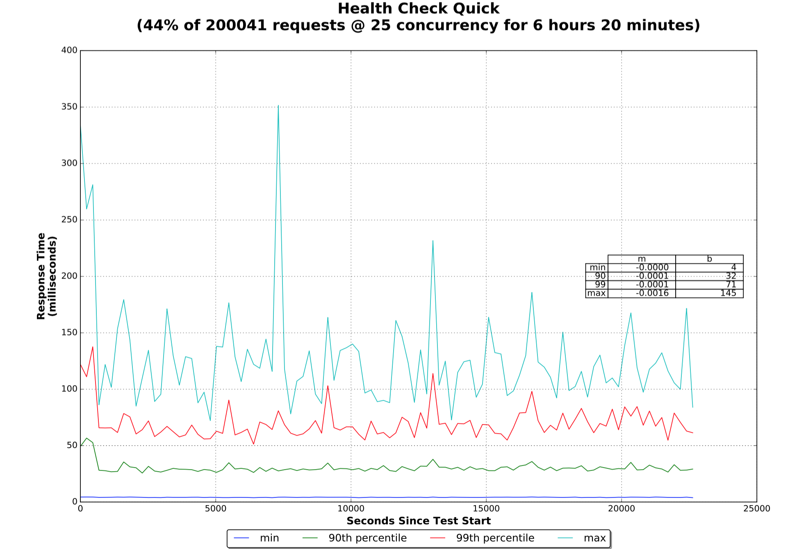

# Load Testing

This directory contains tests and documentation to
validate service performance and stability under various
load/stress scenarios.

[Locust](http://locust.io) is the core load testing tool used to drive
requests thru an ECS deployment. [run_load_test.sh](run_load_test.sh) is
a wrapper around [Locust](http://locust.io) which is responsible for
parsing the load test's json configuration file, optionally spinning up
a local [ecservice.py](../../bin/ecservice.py) and launching
[analyze_load_test_tsv.py](analyze_load_test_tsv.py) to analyze the
results of the load test.
[load-test-config-for-travis.json](load-test-config-for-travis.json)
is an example load test configuration file.

```bash
>jq . load-test-config-for-travis.json
{
  "number_of_requests": 1000,
  "hatch_rate": 5,
  "concurrency": [
    10,
    15,
    20,
    25
  ]
}
>
```

[Locust](http://locust.io) (along with
a few other packages) aren't loaded by default when configuring the dev
environment using ```source cfg4dev```. Before running load tests you
need to pip install all the required packages.

```bash
>pip install --requirement requirements.txt
.
.
.
```

Here's an example of running a basic load test
using [load-test-config-for-travis.json](load-test-config-for-travis.json).

```bash
>tests/load/run_load_test.sh -v tests/load/load-test-config-for-travis.json
Started ECS - PID = 25608; config file '/tmp/tmp.H5e7xZFCoN'
Find locust log file @ '/tmp/tmp.nyG4LGQOtB' for 15 concurrency
Find locust output @ '/tmp/tmp.fS1xDEwLc5' for 15 concurrency
=======================================================================
2034 @ 16 from 2016-04-26 19:16:41.449000 to 2016-04-26 19:20:00.863000
=======================================================================
Request Type                 Ok Error         m        b      Min       50       60       70       80       90       95       99      Max
-----------------------------------------------------------------------------------------------------------------------------------------
Health-Check-Quick          515     0   -0.0027        6        4        5        5        6        7        9       10       14       24
Health-Check-Slow           234     0   -0.0585       82        6       21       36       71      119      264      325      468      693
NoOp                        257     0    0.0010        5        3        4        4        5        5        7       10       14       27
Tasks-Bad-Request-Body       72     0    0.0072        5        4        5        5        6        6        8        9       17       21
Tasks-Happy-Path            612     0   -0.2141     2197      647     2150     2297     2436     2595     2913     3149     4316     5171
Tasks-Image-Not-Found        86     0   -0.6782      969       30      764      857     1029     1330     1467     1612     1993     2015
Version                     258     0   -0.0012        5        3        5        5        5        6        7        9       14       25
=======================================================================
>
```
## Graphing Test Results

As described above, [run_load_test.sh](run_load_test.sh) runs a load
test and then [analyze_load_test_tsv.py](analyze_load_test_tsv.py)
analyzes the results of the load test.
By default [analyze_load_test_tsv.py](analyze_load_test_tsv.py)
generates the numeric results as illustrated above.
In addition to numeric results [analyze_load_test_tsv.py](analyze_load_test_tsv.py)
can also generate a PDF document describing the response times by
request types. Below is a sample of one of these pages and
[here](docs/25-sample-graphs.pdf) is a sample of a complete report.



## Local & Cloud Deployments

By default ```run_load_test.sh``` spins up a local ECS deployment.
```run_load_test.sh``` can also be used to run a load tests against
an existing ECS deployment with the inclusion of the ```endpoint``` property
in the load test configuration document.
If the ECS deployment requires authentication the load test configuration
document should include the ```credentials``` property which points to a file
containing the output of ```ecsctl.sh creds```.

```bash
>cat ecsctl-sh-creds-output.txt
b35ec3fd96564323898920d282c18bb6:21023ce203851e7ec3eb1d25daf0fbcc
8d90c8aa5256454b974582c7f0c7fa76:5668c4e0d53901b26b2e4af6a7229f7d
731f1781575d430c9be46231fc7ad4c5:8e1a9ced90bd606bb5a1b3844b8f2299
1c78d19f3a2942a285c7091221808557:b4140392e719d0e7c6acd1e0e3bb1c12
cdf539dd1ba649e893950fa9f3de9f49:633ad1feaa40f2ecf1776b301e894340
>
```

```bash
>cat deployment.json
{
    "number_of_requests": 100,
    "hatch_rate": 5,
    "concurrency": [5],
    "endpoint": "https://api.ecs.cloudfeaster.com",
    "credentials": "ecsctl-sh-creds-output.txt"
}
```

```bash
>./run_load_test.sh -v deployment.json
Find locust log file @ '/tmp/tmp.aacQxEvsv1' for 5 concurrency
Find locust output @ '/tmp/tmp.fPFYvZEcCZ' for 5 concurrency
.
.
.
>
```

## Rate Limiting

Load tests are intented to stress an ECS deployment
and generate traffic that looks a lot like a DoS attack.
the typical ECS deployment has per node rate limiting rules in place
ie. nodes have defenses in place to protect themselves again DoS
or general abuse. so, if you're going to load test a real ECS deployment
then you'll want to significantly increase the rates. at this time the
only way to increase the rates is to configure them when the deployment is
being spun up. the ```deployment.json``` below illustrates how to set
these rates. take a look @ the ECS API docs for the default rates.

```bash
>cat deployment.json
{
    "docs_domain": "docs.ecs.cloudfeaster.com",
    "api_domain": "api.ecs.cloudfeaster.com",
    "docs_cert": "/vagrant/docs.ecs.cloudfeaster.com.ssl.bundle.crt",
    "docs_key": "/vagrant/docs.ecs.cloudfeaster.com.key",
    "api_cert": "/vagrant/api.ecs.cloudfeaster.com.ssl.bundle.crt",
    "api_key": "/vagrant/api.ecs.cloudfeaster.com.key",
    "api_credentials": "/vagrant/.htpasswd",
    "dh_parameter": "/vagrant/dhparam.pem",
    "api_rate_limiting": {
        "per_ip": {
            "rate_limit": "5000r/s",
            "conn_limit": "5000"
        },
        "per_key": {
            "rate_limit": "500r/s",
            "conn_limit": "500"
        }
    },
    "number_of_nodes": 1
}
>
```

## New Relic

[New Relic](http://newrelic.com/) is a great
[APM](https://en.wikipedia.org/wiki/Application_performance_management)
service that can be very useful for performance tunning.
Running ECS under the New Relic agent while ECS is servicing
requests from a load test generates lots of data for analysis.
ECS is written using [Tornado 4.3](http://www.tornadoweb.org/en/stable/)
and New Relic's support for Tornado has been spotty.
As of 30 Mar '16, [version 2.62.0.47 of New Relic's python agent](https://docs.newrelic.com/docs/agents/python-agent/hosting-mechanisms/introductory-tornado-4-support)
claims to have support for Tornado 4.3 but running ECS under this
agent generates stack traces - see [this](https://support.newrelic.com/tickets/190024) for details.
The New Relic support team have been awesome and are sorting out the problem.

* [newrelic.ini](newrelic.ini) was generated per the instructions
  outlined [here](https://pypi.python.org/pypi/newrelic) (pip install
  new relic and then ```newrelic-admin generate-config %LICENSE_KEY% newrelic.ini```)
  and [here](https://docs.newrelic.com/docs/agents/python-agent/hosting-mechanisms/introductory-tornado-4-support) (add ```feature_flag = tornado.instrumentation.r3```
  to [newrelic.ini](newrelic.ini))
* you'll need to replace ```%LICENSE_KEY%``` in [newrelic.ini](newrelic.ini)
  with your own license key
* use the following to run ECS under the New Relic agent
  ```NEW_RELIC_CONFIG_FILE=newrelic.ini newrelic-admin run-program ecservice.py```
